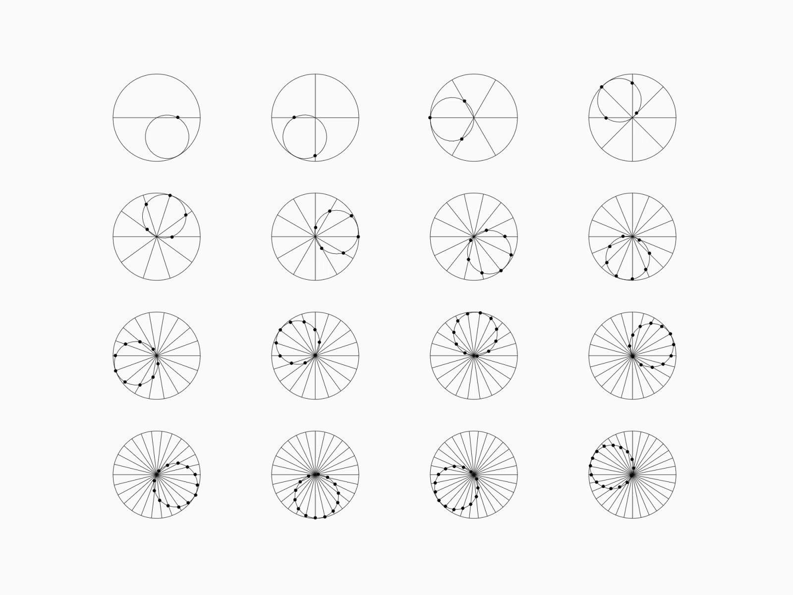

<!-- Heading -->
<h3 align="center"> Hi there! I'm Femi Akinsiku</h3>

<!-- Profile Views -->

 

  <a href="https://femiakin.com/">Website</a> •
  <a href="https://twitter.com/david_akinsiku">Twitter</a>

<!-- code gif-->

# Senior Engineer

I am a senior software engineer with over 5 years of experience in the industry. I specialize in full-stack development, with a particular focus on developing and maintaining large-scale, high-performance web applications.

## Skills

- Proficient in languages such as JavaScript, Typescript and Ruby,
- Experience with modern web development frameworks such as React, Next.js and Vue
- Strong understanding of data structures, algorithms, and software design principles
- Experience with cloud-based infrastructure (AWS, GCP, Azure)
- Familiarity with containerization and orchestration technologies (Docker, Kubernetes)
- For database I use postgres, mysql, mongo, firebase etc
- Strong debugging and problem-solving skills

## Contact

- Email: akinsiku13@gmail.com
- LinkedIn: [https://www.linkedin.com/in/femiakinsiku/](https://www.linkedin.com/in/femiakinsiku/)

<!-- About section: END -->

  <!-- GitHub section -->

## My GitHub Stats 

 

   
  

## GitHub Stats

| My commit history                                                                                                                                                                                                                             |
| --------------------------------------------------------------------------------------------------------------------------------------------------------------------------------------------------------------------------------------------- |
|  |

## Language Usage

<!-- THE END -->
